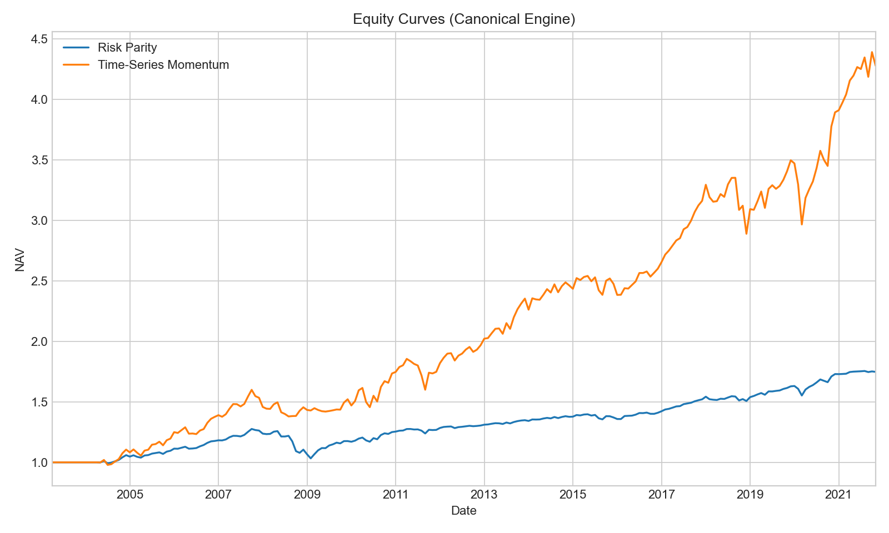

<p align="center">
  
</p>

# Robo-Advisor: A Reproducible Algorithmic Backtesting System

A modular, offline backtesting system that evaluates rule-based portfolio strategies with a focus on **correctness**, **reproducibility**, and **engineering robustness**. It provides a complete pipeline from data ingestion to auditable performance reports.

Two transparent strategies are implemented as case studies:

- **Risk Parity** — inverse-volatility weighting across asset classes
- **Time-Series Momentum (TSMOM)** — trend-following with dynamic allocation



## Results

Backtest period: **2003-03 to 2021-11** | Universe: **8 ETFs** | Rebalancing: **Monthly**

| Metric | Risk Parity | TSMOM |
|--------|:-----------:|:-----:|
| CAGR | 3.0% | 8.1% |
| Volatility | 4.2% | 9.6% |
| Sharpe Ratio | 0.74 | 0.86 |
| Sortino Ratio | 0.76 | 1.13 |
| Max Drawdown | -19.1% | -15.2% |
| Monthly Turnover | 0.32 | 2.03 |

## Key Features

- **Deterministic execution** — identical outputs guaranteed for the same inputs, verified via hash-based protocol
- **Modular pipeline** — separate stages for data ingestion, feature generation, strategy logic, simulation, and evaluation
- **14 unit tests** — validates the backtesting engine, metrics, strategy logic, and data handling
- **Auditable artefacts** — each run exports equity curves, weights, metrics, config snapshots, and reproducibility hashes
- **Walk-forward evaluation** — out-of-sample testing with expanding windows

## Project Structure

```
robo-advisor/
├── config/              # YAML backtest parameters & asset universe
├── data/                # Input price data (see data/README.md)
├── docs/                # Model card, disclosure template, figures
├── notebooks/           # Jupyter notebooks for analysis & visualization
├── reports/             # Generated artefacts (gitignored)
├── src/
│   ├── backtest/        # Portfolio simulation engine
│   ├── metrics/         # Performance & risk calculations
│   ├── strategies/      # Risk parity, momentum
│   ├── utils/           # Determinism seed utilities
│   └── run_pipeline.py  # Main entry point
├── tests/               # Pytest suite
├── requirements.txt
└── LICENSE
```

## Quick Start

### 1. Install

```bash
git clone https://github.com/JaaasperLiu/robo-advisor.git
cd robo-advisor
python3 -m venv .venv && source .venv/bin/activate
pip install -r requirements.txt
```

### 2. Prepare Data

Run notebook `notebooks/01_data_prep.ipynb` to download monthly ETF prices via `yfinance`, or provide your own `data/prices_monthly.csv` (see `data/README.md` for format).

### 3. Run a Backtest

```bash
# Risk Parity strategy
python3 -m src.run_pipeline --strategy=risk_parity

# Time-Series Momentum strategy
python3 -m src.run_pipeline --strategy=momentum
```

**Optional flags:**

```bash
python3 -m src.run_pipeline --strategy=risk_parity \
    --start 2006-01-31 \
    --end 2021-12-31 \
    --tc_bps 5 \
    --max_weight 0.25
```

Results are saved to `reports/`.

### 4. Run Tests

```bash
pytest
```

### 5. Explore

The `notebooks/` directory contains Jupyter notebooks for deeper analysis, visualization, and replication of the dissertation figures and tables.

## Disclaimer

This project is for educational and research purposes only. The strategies, data, and results are part of a controlled academic study and do not constitute investment advice. Not intended for live trading.

## License

[MIT](LICENSE)
